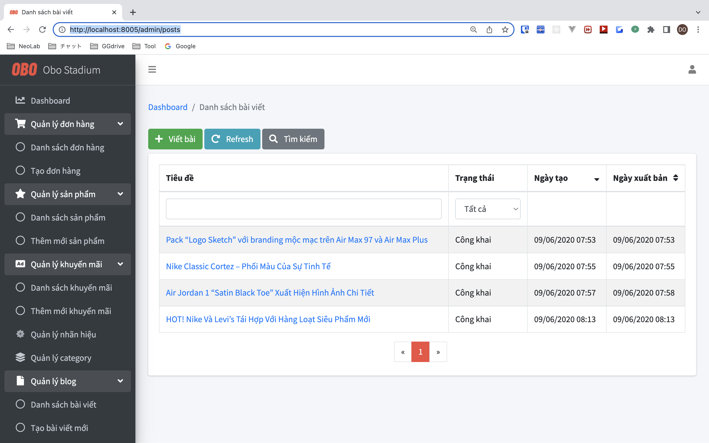
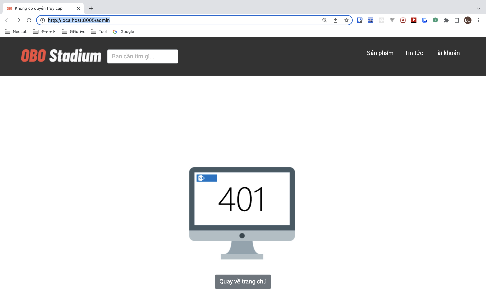

# OBO STADIUM WEBSITE

- shopping site for shoes
- 
- [](https://github.com/tquangdo/spring-boot-docker-shopping-site/issues/new)

## deploy local
1. `docker compose up -d --build`
2. access browser `localhost:8005`


## db info
- `src/main/resources/application-dev.properties`


## API info
- in `src/main/java/com/company/demo/controller/anonymous/*Controller.java` > `@GetMapping("/...")`


## login acc
- Admin account:
    - Username: admin@obostadium.com
    - Password: 123456
- Member account:
    - Username: monguyen@gmail.com
    - Password: 123456
    
## admin page
- access browser `localhost:8005/admin`
- if already login by `admin@obostadium.com`

- otherwise


## note
- due to `Dockerfile` > `ENTRYPOINT ["/usr/local/bin/run_spring_boot_entrypoint.sh"]`, after edit docker info need `--build` & need wait until run spring boot finish:
```shell
Tomcat started on port(s): 8080 (http) with context path ''
Started <XXX project name!!!> in 1.197 seconds (JVM running for 1.501)
```
