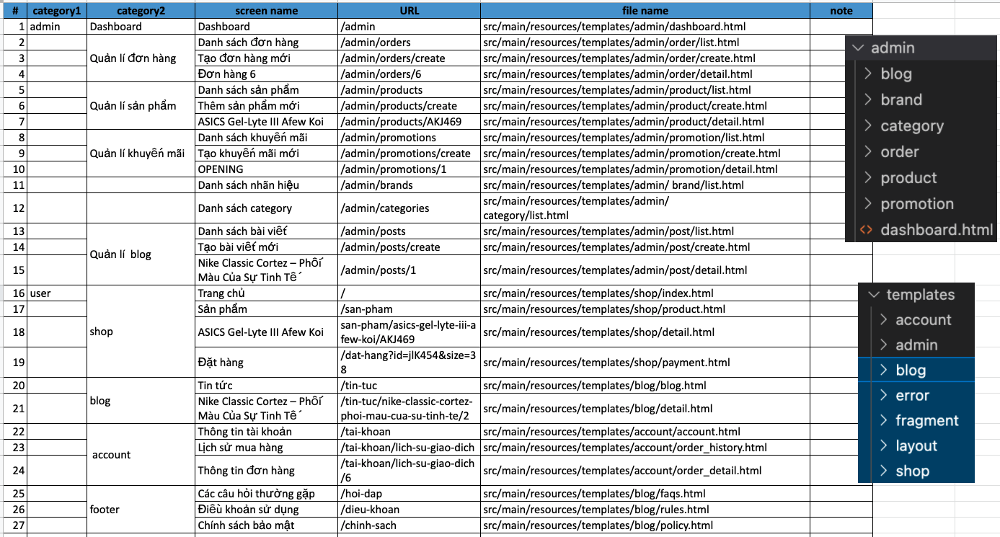

# OBO STADIUM WEBSITE
shopping site for shoes

## deploy local
1. `docker compose up -d --build`
2. access browser `localhost:8005`

## db info
- `src/main/resources/application-dev.properties`

## API info
- in `src/main/java/com/company/demo/controller/anonymous/*Controller.java` > `@GetMapping("/...")`

## login acc
- Admin account:
    - Username: admin@obostadium.com
    - Password: 123456
- Member account:
    - Username: monguyen@gmail.com
    - Password: 123456
    
## admin page
- access browser `localhost:8005/admin`

## note
- due to `Dockerfile` > `ENTRYPOINT ["/usr/local/bin/run_spring_boot_entrypoint.sh"]`, after edit docker info need `--build` & need wait until run spring boot finish